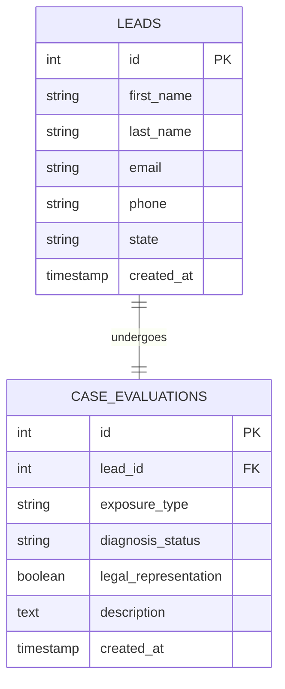

<div align="center">

# ⚖️ Kanzen Assignment: Mesothelioma Claims Backend

[](https://nodejs.org/)
[](https://expressjs.com/)
[](https://www.mysql.com/)
[](https://railway.app/)
[](LICENSE)

<p align="center">
  <strong>A high-performance, secure, and production-ready Express.js API designed to power the Mesothelioma Legal Claims platform. Engineered for seamless deployment on Railway with robust MySQL database management.</strong>
</p>

---

[Explore API Docs](#api-endpoints) • [Local Installation](#-quick-start--installation) • [Railway Deployment](#%EF%B8%8F-railway-deployment) • [Database Architecture](#%EF%B8%8F-database-architecture)

</div>

## 📖 Overview

This repository houses the backend service for the **Mesothelioma Legal Claims** application, built for the Kanzen technical assignment. It delivers a fast, secure, and reliable REST API using Node.js and Express.js, backed by a relational MySQL database. 

Designed with modern DevOps best practices, this repository features comprehensive environment configuration management, automated deployment pipelines, database testing scripts, and pre-configured integration with **Railway** cloud hosting.

---

## ✨ Features

- ⚡ **Lightweight & Fast**: Built with Node.js and Express.js for low latency and high concurrency.
- 🗄️ **Relational Database**: Fully integrated with MySQL using optimized connection pooling.
- 🐳 **Cloud-Ready**: Native configuration files (`railway.json`) and automated shell scripts for instant deployment on Railway.
- 🔒 **Secured by Design**: Configured with CORS security layers and strict environment variable handling via `dotenv`.
- 🛠️ **Developer Friendly**: Features automated database diagnostic scripts, system check tools (`test-connection.js`), and hot-reloading with `nodemon`.
- 📁 **Automated Setup**: Shell script initialization to automate config files, structure validation, and local setup.

---

## 🛠️ Tech Stack

### Backend Core
*  - JavaScript Runtime environment.
*  - Fast, unopinionated, minimalist web framework.

### Database
*  - Relational Database Management System.
*  - Modern, fast MySQL driver for Node.js.

### DevOps & Tools
*  - Cloud deployment and infrastructure provisioning.
*  - Development server live reloading.
*  - Automated local provisioning scripts.

---

## 📂 Project Structure

```bash
kanzen_assgn_backend/
├── database/                   # Database schemas, migrations, and seed files
├── .env                        # Local environment variables (gitignored by default)
├── manual-setup.js             # Automated/Manual database initializer script
├── package.json                # Project dependencies and script runner configurations
├── package-lock.json           # Locked dependency tree
├── railway.json                # Railway configuration specifications
├── server.js                   # Application entry point & API routes definition
├── setup.sh                    # Automation shell script for quick bootstrapping
├── test-connection.js          # Database diagnostic and connection validator
│
│   # 💡 Specialized Setup Documentation
├── RAILWAY_DEPLOYMENT.md       # Step-by-step master Railway deployment guide
├── railway-env-setup.md        # Environment variables configuration for Railway
├── railway-external-connection.md # External MySQL tunnel connection guide
└── setup-railway-env.md        # Scripted Railway configuration manual
```

---

## 🚀 Quick Start & Installation

Ensure you have **Node.js (>= 16.x)** and **MySQL Server (>= 8.0)** installed locally.

### 1. Clone the Repository
```bash
git clone https://github.com/Alok345/kanzen_assgn_backend.git
cd kanzen_assgn_backend
```

### 2. Run the Bootstrap Script (Linux/macOS)
The repository contains an automated setup shell script to configure dependencies and guide your local development setup:
```bash
chmod +x setup.sh
./setup.sh
```

*For Windows users, please run:*
```bash
npm install
```

### 3. Setup Your Environment Variables
Create a `.env` file in the root directory and define the following variables:
```env
PORT=5000
DB_HOST=127.0.0.1
DB_PORT=3306
DB_USER=your_mysql_username
DB_PASSWORD=your_mysql_password
DB_NAME=mesothelioma_claims
```

### 4. Initialize and Seed the Database
Ensure your local MySQL service is running, then execute the diagnostics script to initialize database structure and seeding data:
```bash
node manual-setup.js
```

### 5. Validate the Database Connection
Run the connection suite to verify successful handshakes:
```bash
npm test
```

### 6. Start the Server
*   **Development Mode** (With file watching & hot-reloading):
    ```bash
    npm run dev
    ```
*   **Production Mode**:
    ```bash
    npm start
    ```

The API will spin up at `http://localhost:5000` (or the custom port you configured).

---

## 🛡️ Database Architecture

The application operates on an optimized MySQL schema tailored for managing legal consultations and lead inquiries safely and securely.



---

## 🛣️ API Endpoints

The following routes are available out-of-the-box (configurable in `server.js`):

| Method | Endpoint | Description | Auth Required |
| :--- | :--- | :--- | :--- |
| **GET** | `/` | API Root / System Health Status Check | No |
| **GET** | `/api/health` | Verbose Database & Service Connectivity Health Check | No |
| **POST** | `/api/claims` | Submit a new mesothelioma legal claim/lead | No |
| **GET** | `/api/claims` | Retrieve all submitted claims (Admin Dashboard) | Yes |
| **GET** | `/api/claims/:id`| Retrieve a specific legal claim by ID | Yes |

---

## ☁️ Railway Deployment

Deploying your backend to production on **Railway** is streamlined through pre-loaded configuration files.

### Deploying Automatically via Railway CLI:
1. **Login to Railway**:
   ```bash
   railway login
   ```
2. **Link Project**:
   ```bash
   railway link
   ```
3. **Provision Database & Environment**:
   Refer to `railway-env-setup.md` or execute:
   ```bash
   railway variables:set $(cat .env | xargs)
   ```
4. **Deploy**:
   ```bash
   railway up
   ```

For detailed guides, please consult our specialized cloud deployment handbooks:
- 📖 [Railway Deployment Handbook (RAILWAY_DEPLOYMENT.md)](./RAILWAY_DEPLOYMENT.md)
- 🔒 [Configuring External Database Tunnels (railway-external-connection.md)](./railway-external-connection.md)
- ⚙️ [Configuring Cloud Environment Variables (railway-env-setup.md)](./railway-env-setup.md)

---

## 🛡️ License

This project is licensed under the MIT License - see the [LICENSE](LICENSE) file for details.

---

## 👤 Author

Developed with ❤️ by **[Alok345](https://github.com/Alok345)**. Reach out for any questions, assignment discussions, or implementation reviews!